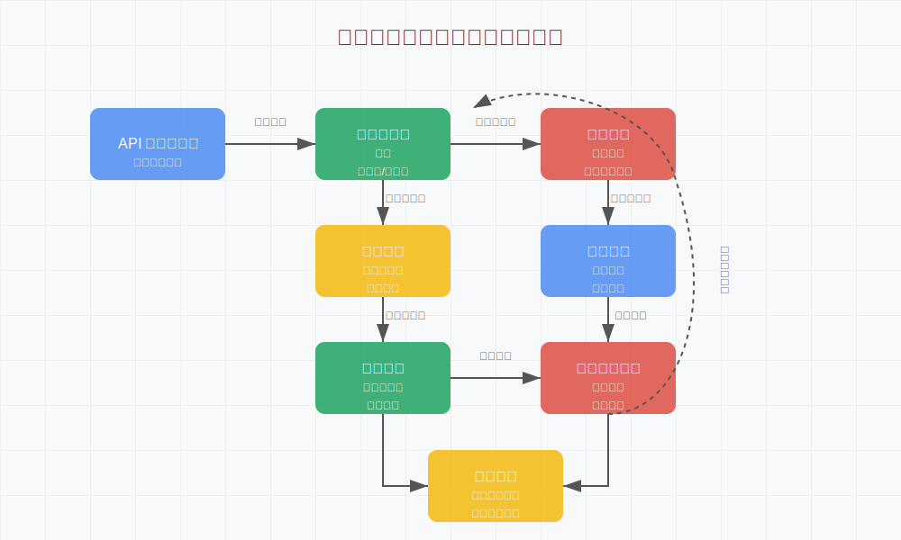

# data-process




# 数据预处理与验证模块

这是一个全面的数据处理和验证框架，用于数据清洗、标准化、转换和验证。该模块适用于数据科学、机器学习和数据分析项目中的数据预处理阶段，特别是对API接收的用户数据进行异常检测和处理。

## 功能特点

### 数据清洗
- **缺失值处理**：多种填充策略（均值、中位数、众数、KNN等）
- **异常值检测与处理**：支持Z-score、IQR和孤立森林等方法
- **重复数据去除**：基于指定列或全部列的重复数据检测和移除
- **噪声数据过滤**：使用移动平均等方法平滑数据

### 数据标准化/归一化
- **Z-Score标准化**：将数据转换为均值0、标准差1的分布
- **Min-Max归一化**：将数据缩放到指定范围（如0-1）
- **Robust缩放**：基于四分位数的缩放，对异常值不敏感
- **对数变换**：处理偏斜分布数据

### 数据转换
- **类型转换**：灵活处理各种数据类型转换
- **One-Hot编码**：将分类变量转换为二进制向量
- **标签编码**：将分类变量映射为数值
- **时间特征提取**：从日期时间列提取有用特征（年、月、日、周几等）

### 数据验证
- **数据完整性检查**：必要字段检查、数据聚合验证、条数验证、外键完整性等
- **数据格式验证**：类型校验、范围检查、正则表达式匹配、结构一致性验证
- **业务规则验证**：领域规则、跨字段关系、时序数据一致性、业务流程合规性等

## 安装

```bash
# 克隆仓库
git clone https://github.com/yourusername/data-processor.git
cd data-processor

# 安装依赖
pip install -r requirements.txt
```

## 快速开始

### 基本用法

```python
from data_processor import DataProcessor

# 初始化处理器
processor = DataProcessor()

# 定义处理配置
config = {
    'cleaning': {
        'missing_values': {'strategy': 'auto'},
        'outliers': {'detection_method': 'zscore', 'handle': True}
    },
    'normalization': {
        'z_score': True,
        'z_score_columns': ['age', 'income']
    },
    'transformation': {
        'one_hot_encoding': {'columns': ['category']}
    },
    'validation': {
        'completeness': {'required_fields': ['id', 'name']}
    }
}

# 处理数据
processed_df = processor.process(df, config)

# 获取处理摘要
summary = processor.get_processing_summary()

# 保存处理后的数据
processor.save_processed_data('processed_data.csv')

# 保存检测到的异常数据
processor.save_anomalies('anomalies.csv')
```

### 配置示例

```python
# 完整配置示例
config = {
    'cleaning': {
        'missing_values': {
            'strategy': 'auto',  # 可选: 'drop', 'mean', 'median', 'mode', 'forward', 'backward', 'knn', 'auto'
            'threshold': 0.3  # 高于此比例缺失值的列将被删除
        },
        'outliers': {
            'detection_method': 'iqr',  # 可选: 'zscore', 'iqr', 'isolation_forest'
            'handle': True,
            'handle_strategy': 'winsorize'  # 可选: 'remove', 'winsorize', 'cap'
        },
        'remove_duplicates': True,
        'duplicate_subset': ['id', 'email'],  # 基于这些列判断重复
        'noise_filtering': {
            'columns': ['value'],
            'window_size': 3
        }
    },
    'normalization': {
        'z_score': True,
        'z_score_columns': ['age', 'income'],
        'min_max': True,
        'min_max_columns': ['score'],
        'min_max_range': (0, 1),
        'log_transform': True,
        'log_columns': ['price']
    },
    'transformation': {
        'type_conversion': {
            'id': 'int',
            'date': 'datetime',
            'is_active': 'bool'
        },
        'one_hot_encoding': {
            'columns': ['category', 'region'],
            'drop_first': True
        },
        'datetime_features': {
            'columns': ['date'],
            'features': ['year', 'month', 'dayofweek', 'is_weekend']
        }
    },
    'validation': {
        'completeness': {
            'required_fields': ['id', 'name', 'email']
        },
        'format': {
            'data_types': {
                'id': 'int',
                'email': 'str'
            },
            'value_ranges': {
                'age': {'min': 0, 'max': 120},
                'score': {'min': 0, 'max': 100}
            },
            'regex_patterns': {
                'email': r'^[a-zA-Z0-9._%+-]+@[a-zA-Z0-9.-]+\.[a-zA-Z]{2,}$'
            }
        },
        'business_rules': {
            'domain_rules': {
                'valid_age': lambda df: df['age'] >= 18
            },
            'cross_field_relations': {
                'price_check': lambda df: df['price'] <= df['max_price']
            }
        }
    }
}
```

## 模块结构

```
data_processor/
├── __init__.py
├── data_processor.py   # 主模块
├── utils/              # 辅助工具
│   ├── __init__.py
│   └── logging_utils.py
├── examples/           # 示例代码
│   ├── __init__.py
│   └── basic_usage.py
└── config/             # 配置示例
    └── config_example.json
```

## 主要类

- **DataCleaner**: 处理数据清洗任务
- **DataNormalizer**: 处理数据标准化/归一化任务
- **DataTransformer**: 处理数据转换任务
- **DataValidator**: 处理数据验证任务
- **DataProcessor**: 集成上述类的主处理器

## 日志和监控

该模块提供了详细的日志记录，包括处理步骤、异常检测和验证结果等。日志默认保存在`data_processor.log`文件中。

## 扩展和自定义

您可以通过继承基类来扩展功能:

```python
from data_processor import DataCleaner

class CustomCleaner(DataCleaner):
    def __init__(self, **kwargs):
        super().__init__(**kwargs)
    
    def custom_cleaning_method(self, df):
        # 自定义清洗逻辑
        return cleaned_df
```

## 依赖

- pandas >= 1.3.0
- numpy >= 1.20.0
- scikit-learn >= 0.24.0
- scipy >= 1.7.0
