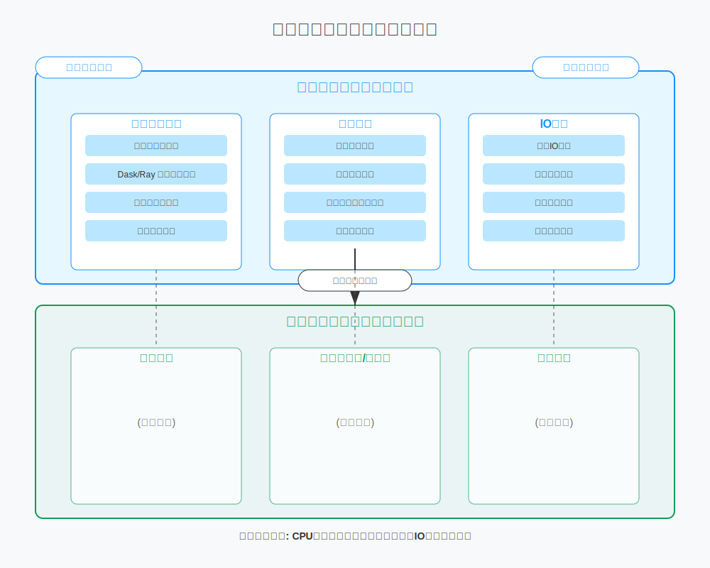
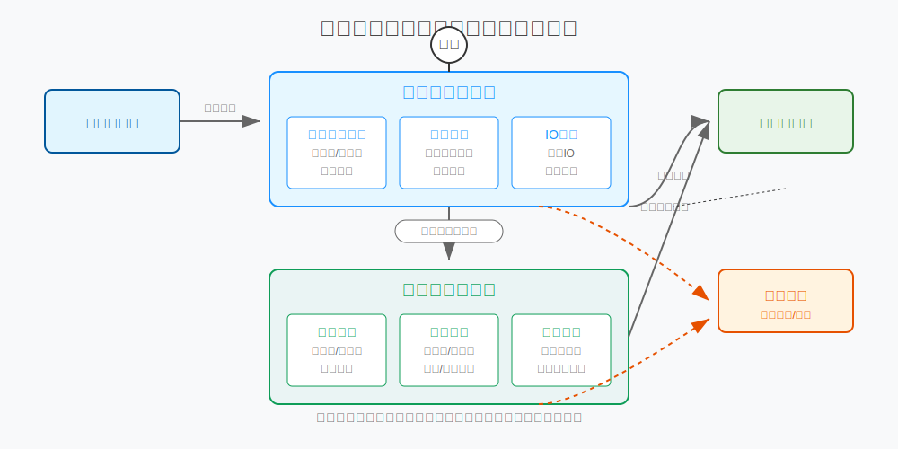

# DataForge

一个全面的数据预处理、标准化、转换和验证框架，专为数据科学家、机器学习工程师和数据分析师设计。
[](https://www.python.org/downloads/)
[](https://opensource.org/licenses/MIT)





## 概述

DataForge提供了一个强大的框架，用于处理和验证来自各种来源的数据。它简化了常见的预处理任务，检测异常，并为下游分析或建模准备数据。通过配置驱动的方法，您可以轻松创建可重复的数据处理流程。该框架提供标准处理和高性能处理两种模式，可根据数据规模和处理需求灵活选择。

## 核心功能

### 数据清洗
- **缺失值处理**：多种填充策略（均值、中位数、众数、KNN等）并具有自动策略选择功能
- **异常值检测与处理**：Z-score、IQR、孤立森林方法，支持可视化
- **重复数据去除**：基于指定列或所有列
- **噪声过滤**：使用可配置参数的平滑技术

### 数据标准化
- **Z-Score标准化**：将数据转换为均值为0、标准差为1的分布
- **Min-Max归一化**：将数据缩放到特定范围（例如0-1）
- **稳健缩放**：使用四分位数进行对异常值不敏感的缩放
- **对数变换**：处理偏斜分布

### 数据转换
- **类型转换**：灵活处理各种数据类型转换
- **独热编码**：将分类变量转换为二进制向量，支持基数管理
- **标签编码**：将分类变量映射为数值，支持自定义映射
- **日期时间特征提取**：从日期时间列提取有用特征，包括周期性编码

### 数据验证
- **完整性检查**：必填字段、聚合验证、记录计数
- **格式验证**：类型检查、范围/边界验证、正则表达式匹配
- **业务规则验证**：领域特定规则、跨字段关系
- **时间序列一致性**：检测时间序列数据中的异常变化
- **工作流合规性**：验证业务流程中的状态转换

### 高性能处理引擎
- **并行处理**：多进程、多线程和分布式计算支持
- **内存优化**：智能数据类型选择，减少内存占用
- **IO优化**：异步读写、数据预取和分块处理
- **大规模数据**：处理超出内存大小的数据集

## 安装

```bash
# 克隆仓库
git clone https://github.com/jerry609/data-process.git
cd data-process/data-processor

# 安装依赖
pip install -r requirements.txt

# 安装高性能引擎的额外依赖（可选）
pip install -r requirements-high-perf.txt
```

## 依赖项
### 基本依赖
- pandas >= 1.3.0
- numpy >= 1.20.0
- scikit-learn >= 0.24.0
- scipy >= 1.7.0
- matplotlib >= 3.4.0 (用于可视化)

### 高性能引擎额外依赖（可选）
- dask >= 2023.1.0
- ray >= 2.3.0
- psutil >= 5.9.0
- aiofiles >= 23.1.0

## 快速开始

### 标准处理

```python
import pandas as pd
from data_processor import DataProcessor

# 加载您的DataFrame
df = pd.read_csv('your_data.csv')

# 初始化处理器
processor = DataProcessor()

# 定义处理配置
config = {
    'cleaning': {
        'missing_values': {'strategy': 'auto'},
        'outliers': {
            'detection_method': 'zscore', 
            'handle': True,
            'handle_strategy': 'winsorize'
        },
        'remove_duplicates': True
    },
    'normalization': {
        'z_score': True,
        'z_score_columns': ['numeric_col1', 'numeric_col2']
    },
    'transformation': {
        'type_conversion': {'date_col': 'datetime', 'id_col': 'int'},
        'one_hot_encoding': {
            'columns': ['categorical_col'],
            'max_categories': 10
        }
    },
    'validation': {
        'completeness': {'required_fields': ['id', 'name']},
        'format': {
            'regex_patterns': {'email': '^[a-zA-Z0-9._%+-]+@[a-zA-Z0-9.-]+\\.[a-zA-Z]{2,}$'}
        }
    }
}

# 处理数据
processed_df = processor.process(df, config)

# 获取处理摘要
summary = processor.get_processing_summary()
print(summary)

# 保存处理后的数据
processor.save_processed_data('processed_data.csv')

# 保存检测到的异常
processor.save_anomalies('anomalies.csv')
```

### 高性能处理

```python
import pandas as pd
from data_processor import DataProcessor

# 加载您的数据集
df = pd.read_csv('large_dataset.csv')  # 或直接传入文件路径

# 高性能配置
high_perf_config = {
    'num_workers': 8,              # 使用8个工作进程
    'scheduler': 'processes',      # 使用进程级并行
    'optimize_dtypes': True,       # 优化数据类型
    'use_mmap': True,              # 使用内存映射文件
    'prefetch_size': 3             # 预取3个数据块
}

# 初始化带高性能引擎的处理器
processor = DataProcessor(use_high_perf=True, high_perf_config=high_perf_config)

# 加载处理配置
config = processor.load_config('config/high_perf_config.json')

# 处理数据（大规模数据集）
processed_df = processor.process(df, config)

# 获取性能报告
if processor.use_high_perf:
    performance = processor.high_perf_cleaner.get_performance_report()
    print(f"处理速度: {performance['rows_per_second']:.0f} 行/秒")
    print(f"内存峰值: {performance['memory_peak_mb']:.2f} MB")

# 保存结果
processor.save_processed_data('processed_large_dataset.parquet', format='parquet')
```

## 项目结构

```
data_processor/
├── __init__.py
├── core/                        
│   ├── __init__.py
│   ├── processor.py             # 主处理器类
│   ├── high_perf_engine/        # 高性能引擎目录
│   │   ├── __init__.py
│   │   ├── parallel_engine.py   # 并行处理引擎
│   │   ├── memory_manager.py    # 内存优化管理器
│   │   ├── io_optimizer.py      # IO优化器
│   │   └── cleaner.py           # 高性能清洗协调器
│   └── modules/
│       ├── __init__.py
│       ├── base.py              # 基础模块类
│       ├── cleaner.py           # 数据清洗模块
│       ├── normalizer.py        # 数据标准化模块
│       ├── transformer.py       # 数据转换模块
│       └── validator.py         # 数据验证模块
├── utils/
│   ├── __init__.py
│   ├── logging_utils.py         # 日志工具
│   └── performance_monitor.py   # 性能监控工具
├── examples/
│   ├── __init__.py
│   ├── basic_usage.py           # 基本使用示例
│   └── high_perf_usage.py       # 高性能模块使用示例
└── config/
    ├── config_example.json      # 标准配置示例
    └── high_perf_config.json    # 高性能配置示例
```

## 配置选项

该框架使用JSON配置文件来指定处理步骤：

### 高性能引擎

```json
"high_performance": {
    "enabled": true,
    "num_workers": null,              // null表示使用所有可用CPU核心
    "scheduler": "processes",         // 选项: "processes", "threads", "distributed"
    "chunk_size": "auto",             // 自动或指定大小
    "optimize_dtypes": true,          // 是否优化数据类型
    "use_mmap": true,                 // 使用内存映射
    "gc_threshold": 0.75,             // 触发垃圾回收的内存占用阈值
    "use_async": true,                // 使用异步IO
    "prefetch_size": 2,               // 预取块数量
    "compression": "snappy"           // 存储压缩格式
}
```

### 数据清洗

```json
"cleaning": {
    "missing_values": {
        "strategy": "auto"  // 选项: "auto", "mean", "median", "mode", "drop", "forward", "backward", "knn"
    },
    "outliers": {
        "detection_method": "zscore",  // 选项: "zscore", "iqr", "isolation_forest"
        "handle": true,
        "handle_strategy": "winsorize"  // 选项: "remove", "winsorize", "cap"
    },
    "remove_duplicates": true,
    "duplicate_subset": ["col1", "col2"],  // 可选: 考虑重复的列
    "noise_filtering": {
        "columns": ["value", "price"],
        "window_size": 3
    }
}
```

### 数据标准化

```json
"normalization": {
    "z_score": true,
    "z_score_columns": ["value1", "value2"],
    "min_max": false,
    "min_max_columns": null,
    "min_max_range": [0, 1],
    "robust": false,
    "robust_columns": null,
    "log_transform": false,
    "log_columns": null,
    "log_base": "e",  // 或数值
    "log_offset": 1.0
}
```

### 数据转换

```json
"transformation": {
    "type_conversion": {
        "id": "int",
        "date": "datetime",
        "price": "float"
    },
    "one_hot_encoding": {
        "columns": ["category", "product_type"],
        "drop_first": true,
        "max_categories": 10
    },
    "label_encoding": {
        "columns": ["status", "priority"],
        "mapping": null  // 可选: 自定义映射
    },
    "datetime_features": {
        "columns": ["date", "created_at"],
        "features": ["year", "month", "dayofweek", "is_weekend", "hour", "cyclical_month"]
    }
}
```

### 数据验证

```json
"validation": {
    "completeness": {
        "required_fields": ["id", "value", "date"],
        "record_count": {
            "expected": 1000,
            "tolerance_percent": 5.0
        }
    },
    "format": {
        "data_types": {
            "id": "int",
            "value": "float"
        },
        "value_ranges": {
            "value": {"min": 0, "max": 200, "inclusive": true},
            "age": {"min": 18, "max": null, "inclusive": true}
        },
        "regex_patterns": {
            "email": "^[a-zA-Z0-9._%+-]+@[a-zA-Z0-9.-]+\\.[a-zA-Z]{2,}$",
            "phone": "^\\+?\\d{10,15}$"
        }
    },
    "business_rules": {
        "domain_rules": {
            // 在Python代码中定义的函数
        },
        "cross_field_relations": {
            // 在Python代码中定义的函数
        },
        "time_series_consistency": {
            "time_col": "date", 
            "value_col": "price",
            "max_change_percent": 200.0
        }
    }
}
```

## 示例

### 基本处理流程

```python
# 创建示例数据
import pandas as pd
import numpy as np

data = {
    'id': range(1, 1001),
    'category': np.random.choice(['A', 'B', 'C', 'D'], 1000),
    'value': np.random.normal(100, 20, 1000),
    'date': pd.date_range(start='2023-01-01', periods=1000),
    'status': np.random.choice(['pending', 'approved', 'rejected'], 1000),
    'email': [f"user{i}@example.com" if i % 10 != 0 else None for i in range(1, 1001)]
}

# 添加一些异常和缺失值
data['value'][10:20] = np.nan  # 缺失值
data['value'][30:40] = 500  # 异常值

df = pd.DataFrame(data)

# 使用基本配置处理
from data_processor import DataProcessor

processor = DataProcessor()
config = processor.load_config('config/config_example.json')
processed_df = processor.process(df, config)

# 检查验证结果
validation_summary = processor.get_processing_summary()['validation_summary']
print(f"验证通过率: {validation_summary['overall']['pass_rate'] * 100:.1f}%")
```

### 大规模数据处理

```python
from data_processor import DataProcessor
from data_processor.utils.performance_monitor import PerformanceMonitor

# 创建性能监控器
monitor = PerformanceMonitor(interval=1.0)
monitor.start_monitoring()

try:
    # 配置高性能处理
    processor = DataProcessor(use_high_perf=True)
    
    # 加载大型数据集
    with monitor.time_operation("数据加载"):
        # 可以直接传入文件路径，高性能引擎会使用流式加载
        data_source = "large_dataset.csv"  # 可以是10GB+的文件
    
    # 设置高性能参数与处理配置
    config = processor.load_config('config/high_perf_config.json')
    
    # 处理数据
    with monitor.time_operation("数据处理"):
        result = processor.process(data_source, config)
    
    # 保存结果
    with monitor.time_operation("保存结果"):
        processor.save_processed_data('processed_large_dataset.parquet', format='parquet')
    
    # 获取性能指标
    print("\n处理性能统计:")
    performance = processor.high_perf_cleaner.get_performance_report()
    print(f"总处理时间: {performance['total_duration_seconds']:.2f}秒")
    print(f"处理速度: {performance['rows_per_second']:.0f}行/秒")
    print(f"内存峰值: {performance['memory_peak_mb']:.2f}MB")
    
    # 输出详细时间分布
    time_breakdown = performance['time_breakdown_percent']
    print("\n时间分配:")
    print(f"IO操作: {time_breakdown['io']:.1f}%")
    print(f"数据处理: {time_breakdown['processing']:.1f}%")
    print(f"内存优化: {time_breakdown['optimization']:.1f}%")
    
finally:
    # 停止监控
    monitor.stop_monitoring()
    
    # 生成性能报告
    monitor.generate_report("performance_report.html")
    
    # 绘制性能图表
    monitor.plot_performance_summary()
```

### 自定义业务规则

```python
def validate_price_margin(df):
    """自定义业务规则来验证价格利润率"""
    return (df['selling_price'] - df['cost_price']) / df['cost_price'] <= 2.0

config = {
    # ... 其他配置选项 ...
    "validation": {
        "business_rules": {
            "domain_rules": {
                "price_margin": validate_price_margin
            }
        }
    }
}
```

## 高级用法

### 使用自定义处理步骤

```python
# 首先应用基本处理
basic_df = processor.process(df, basic_config)

# 然后应用高级处理
advanced_df = processor.process(basic_df, advanced_config)

# 检查每个步骤的变化
print(f"原始形状: {df.shape}")
print(f"基本处理后: {basic_df.shape}")
print(f"高级处理后: {advanced_df.shape}")
```

### 保存和加载处理配置

```python
# 保存配置以实现可重复性
processor.save_config(config, 'my_processing_config.json')

# 加载先前使用的配置
saved_config = processor.load_config('my_processing_config.json')

# 使用相同的配置处理新数据
new_df = pd.read_csv('new_data.csv')
new_processed_df = processor.process(new_df, saved_config)
```

### 动态切换高性能模式

```python
# 初始化普通处理器
processor = DataProcessor()

# 处理小型数据集
small_result = processor.process(small_df, config)

# 当需要处理大型数据集时，启用高性能模式
processor.enable_high_performance(
    config={
        'num_workers': 8,
        'scheduler': 'processes',
        'use_mmap': True
    }
)

# 处理大型数据集
large_result = processor.process('large_dataset.csv', config)

# 检查是否使用了高性能模式
print(f"高性能模式活跃: {processor.use_high_perf}")
```

## 性能对比

待续（等待实验）

*OOM = 内存不足

## 文档

详细文档，请参阅[使用指南](USAGE.md)。

